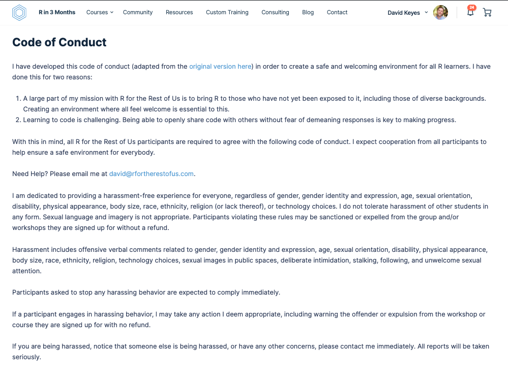

```{r child = "setup.Rmd"}
```


# Agenda

--

1. Welcome

--

1. Logistics

--

1. Questions on Getting Started with R

--

1. Next Week


---


class: center, middle, dk-section-title

# Welcome

---

## Introductions

--

.center[

]

---

## Who Are You?


---

## Code of Conduct




---

## Breakout Rooms

--

Share with the people in your breakout room: 

--

- Name

--

- Pronouns

--

- Location

--

- Organization

--

- Where you hope to be in 3 months

--

- One question you had on Getting Started

---

class: center, middle, dk-section-title

# Logistics

---

## R in 3 Months Group

[](https://rfortherestofus.com/groups/r-in-3-months-spring-2021/forum/)

---

## Survey

[](https://docs.google.com/forms/d/e/1FAIpQLSdRWALRAzMBCYKMVTCeNx4B8uh9LF8LU2xZZfY4IyDqvOZ8aw/viewform)


---

## Google Sheet

[](https://docs.google.com/spreadsheets/d/1Jx6wQQNBClrcfMkfDcWuHjlLEVWHcj6Nk0sU7uVBOOg/edit?usp=sharing)


---

class: dk-section-title, center, middle

## Weekly Plan

---

## Weekly Plan

--

**Wednesday**

--

- Complete lessons and post any questions

--

- Complete project assignment and post link to code

--

**Thursday**

--

- Live session

--

- Video posted that afternoon Pacific time

--

**Friday** (most weeks)

--

- Feedback on your project code


---


### Course Assignment


---

### Project Assignment


---

### Your Project

--

- Something you're working on now

--

- Something you've done before

--

- If no ideas, use [Tidy Tuesday data](https://github.com/rfordatascience/tidytuesday)

---

## Accountability

Let's discuss!


---

class: center, middle, dk-section-title

# Getting Started Questions

???

- Tidyverse loading message
- read.csv vs read_csv
- How often to update packages

---

class: center, middle, dk-section-title

# Next Week

---

## RMarkdown

R's Killer Feature!

???

https://rstudio-conf-2020.github.io/r-for-excel/

---

## Course Assignment

- If you have questions specific to the lesson, post them below the lesson

--

- If you have more general questions, post them in the group thread

---

## Project Assignment

- Write the introduction to your report in RMarkdown

--

- Create a GitHub account

--

- Post your code as a [gist](http://gist.github.com/)

--

- Post the link to your gist in the Week 2: Project Assignment thread

--

- Charlie or I will give you feedback


