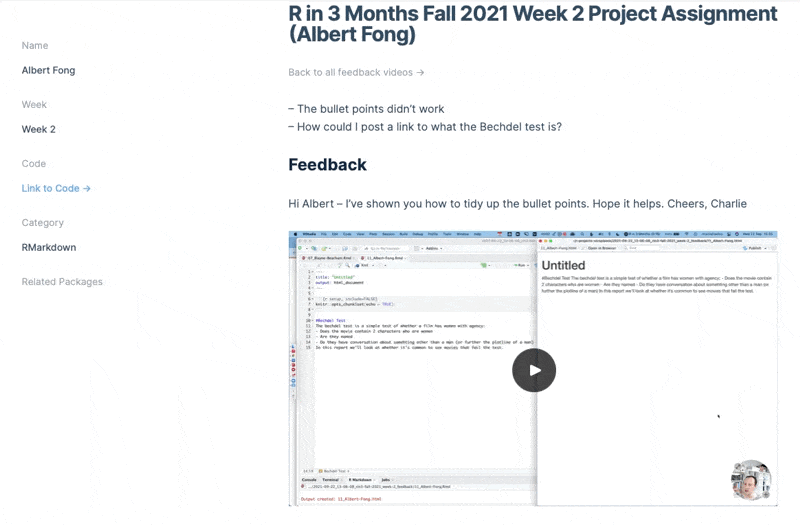

```{r child = "setup.Rmd"}
```


# Agenda

--

1. Housekeeping

--

1. Whole group: discuss common issues, visual editor, and cheatsheets

--

1. Breakout groups: discuss projects + do some exercises

--

1. Next Week

---

class: dk-section-title, center, middle

# Housekeeping

---

## Feedback



---

## Feedback

You should be getting emails when we post feedback

--

You can see everyone's feedback here: http://rfor.us/fall21feedback

???

- Hopefully you've recieved an email with your feedback, let us know if that's not working

- You can see everyone's feedback on the feedback page.

---

class: dk-section-title, center, middle

# Common Issues

---

## Common Issues

--

RMarkdown is particular about spacing

--

Styling of knitted RMarkdown documents

--

Visual editor

--

Cheatsheets (see rfor.us/cheatsheets)

--

Maps

???

- Issues from not putting empty lines between distinct parts of the RMarkdown document - mostly this was issues with bullet point lists, but a lack of spacing between headings and paragraph text would have caused issues as the reports grew.

- Adding blank lines between bullet points will increase spacing between bullets and improves readability of reports.

- Styling of knitted RMarkdown documents. Let's talk about a few things: 1) we'll get to this more later, 2) how you style depends on your output format, 3) for now, people may just want to use pre-built themes.

- The visual editor is a new feature of RStudio (you might need to upgrade if you can't see it)

- Charlie's going to put together a thread on the discussion page about making maps [David: I'll do this on Thursday]

---

class: dk-section-title, center, middle

# Breakout Groups

---

## Breakout Groups

1. Discuss your projects (what went well, what confused you, etc.).

--

1. Look at the gist at rfor.us/noknit. Figure out why it's not knitting. 

--

1. Look at the RMarkdown document at rfor.us/rmdknit. Guess what will happen when you knit it, then knit it and see if you were right. Discuss why/why not.

---

class: dk-section-title, center, middle

# Next Week

---

## For Next Week

1. Complete data wrangling and analysis lessons in Fundamentals

--

1. Do some simple data analysis using your data and add it to your report

--

1. Post your code as a [gist](http://gist.github.com/)

--


1. Post the URL to your gist in the Week 3 Project Assignment Lesson

---

## Adding data files to Gists

--

While we're using gists in the course we're limited to data files being .csv files.

--

You can add a .csv file by dragging it into your Gist.

--

Once we've introduced GitHub we can progress to working with Excel files (and any other file types).

???

Note to David: I thought this was useful to mention? In Spring 2021 we already had folks using GitHub at this point... what do you think?
