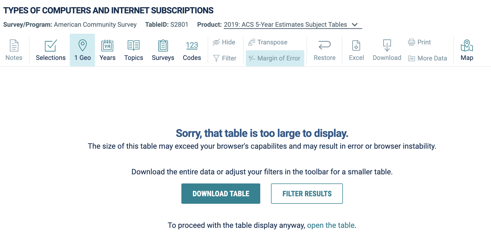

```{r child = "setup.Rmd"}
```

```{r, include=FALSE, eval = TRUE}
options(htmltools.preserve.raw = FALSE)
library("tidyverse")
library("wakefield")
library(palmerpenguins)
library(janitor)
```


# Agenda

--

1. Housekeeping

--

1. Four Tips

--

1. GitHub

--

1. Next Week

---

# Housekeeping

--

- Catch-up Week

--

- Create discussion threads for general questions (eg how to to get data from Tableau Dashboards)

???

1. Any questions that came up during catch-up?

2. I don't really know how to say this tactically...

---

class: inverse, center, middle

# Four Tips

---

## Do all websites give download links?

<a href='https://data.census.gov/cedsci/table?q=S2801&g=0100000US%240500000&tid=ACSST5Y2019.S2801&hidePreview=true'><center></center></a>

---

## Do all websites give download links?

- Sometimes you can find an R package for accessing data

  - [{tidycensus}](https://walker-data.com/tidycensus/) contains data from the US Census
  
  - [{WDI}](https://vincentarelbundock.github.io/WDI/) contains data from the World Bank
  
- You might be able to scrape the webpage or use an API (Charlie's putting together a discussion thread on this).

---

## Working with `tabyl` objects

When you use `tabyl()` it creates a special `data.frame` which are manipulated with the `adorn_*()` functions.

--

**But** sometimes you need to turn it back into a tibble:

--

```{r}
gss_cat %>% 
  tabyl(marital) %>% 
  adorn_totals(c("row", "col")) %>% 
  untabyl()
```

---

## Creating beautiful tables in RMarkdown

--

There are **many** packages for creating beautiful tables in RMarkdown.

--

- Create very simple tables with `knitr::kable()`

--

- [Create fancy static tables with `{gt}`](https://themockup.blog/posts/2020-09-04-10-table-rules-in-r/)

- Create fancy interactive tables with [{reactable}](https://glin.github.io/reactable/articles/womens-world-cup/womens-world-cup.html) or [{DT}](https://rstudio.github.io/DT/extensions.html#buttons)

--

For more, see https://rfor.us/tables

---

## Rounding

--

> Can you help me better understand the round function? I don’t understand the digits part? Does it only apply to decimals? What if you want to round to the nearest whole number what would you put? Or to round to the nearest 10?

---

## Rounding

```{r}
round(14.5)
```

--

```{r eval = TRUE, echo = FALSE}
round(14.5)
```

--

The `round()` function rounds to the nearest **even** number

---

## Rounding

If you want to round 0.5 up, use `janitor::round_half_up()`

```{r}
library(janitor)

round_half_up(14.5)
```

--

```{r eval = TRUE, echo = FALSE}
round_half_up(14.5)
```

---

class: inverse, center, middle

# Git + GitHub

---

## Group Work

In a group, nominate one person to create a new project, add a local Git repository, and then push it to GitHub.

--

Have the nominated person share their screen and then walk through the steps as a group

--

Add any questions that come up to [this discussion thread](https://rfortherestofus.com/groups/r-in-3-months-fall-2021/forum/discussion/general-git-github-questions/).

---

class: inverse, center, middle

## Git + GitHub Questions

???

Need to save first in order to commit

Can only commit items that have been modified since last commit


---

# Next Week

--

1. Advanced data wrangling

--

1. The main thing to make sense of is the concept of tidy data (it's a hard concept, but worth the effort to figure it out!)

--

1. Project assignment: figure out ways your data is not tidy and tidy it (sounds simple, but it's not!)

--

1. You'll work in your GitHub repository from now on so you'll submit a link to the code in your repo for Charlie's review


