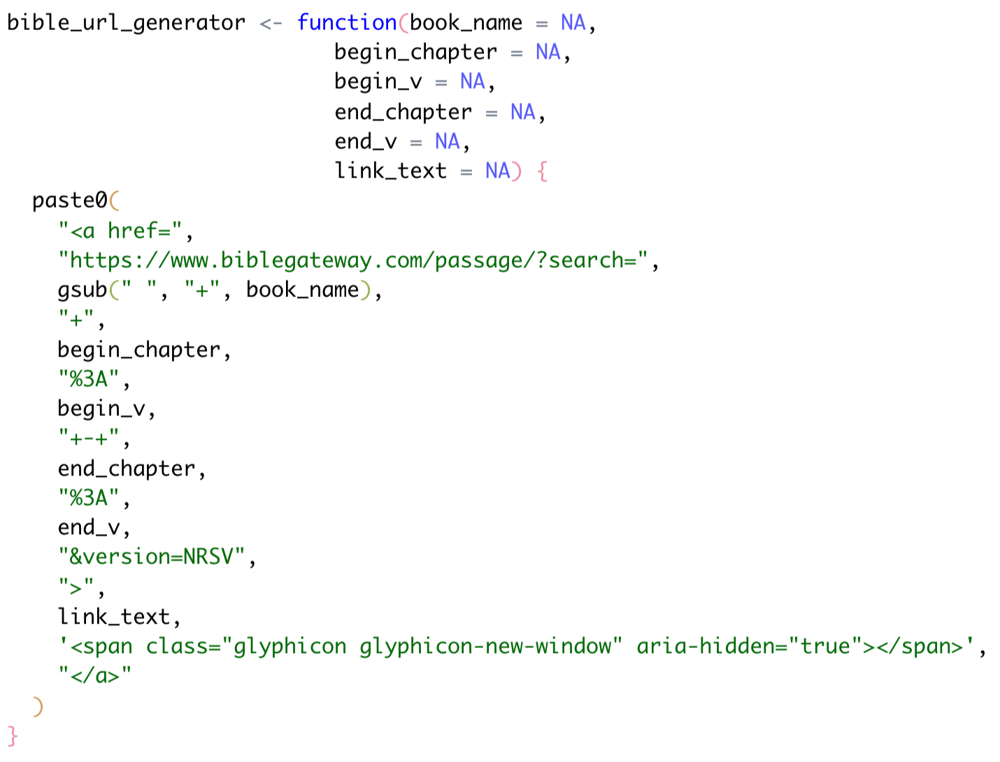
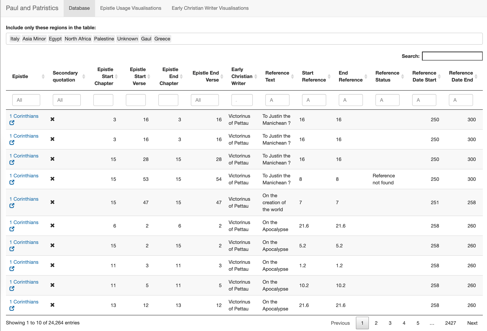
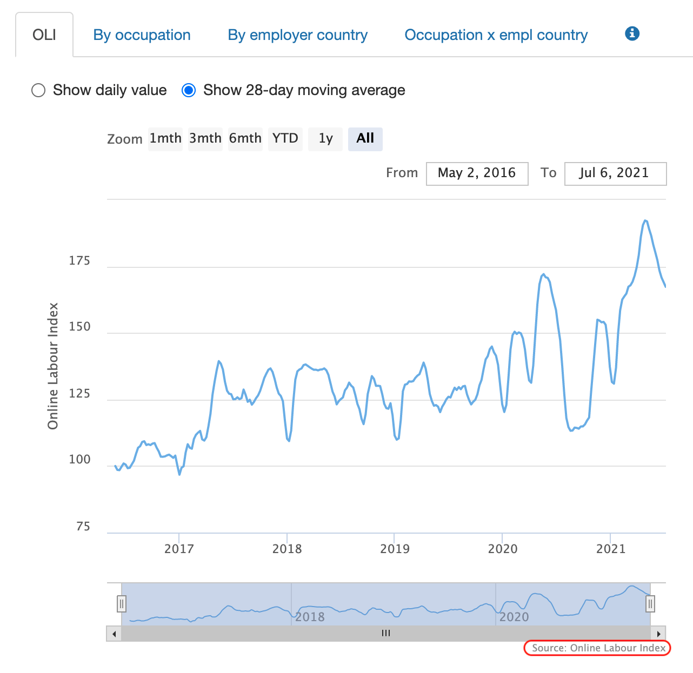
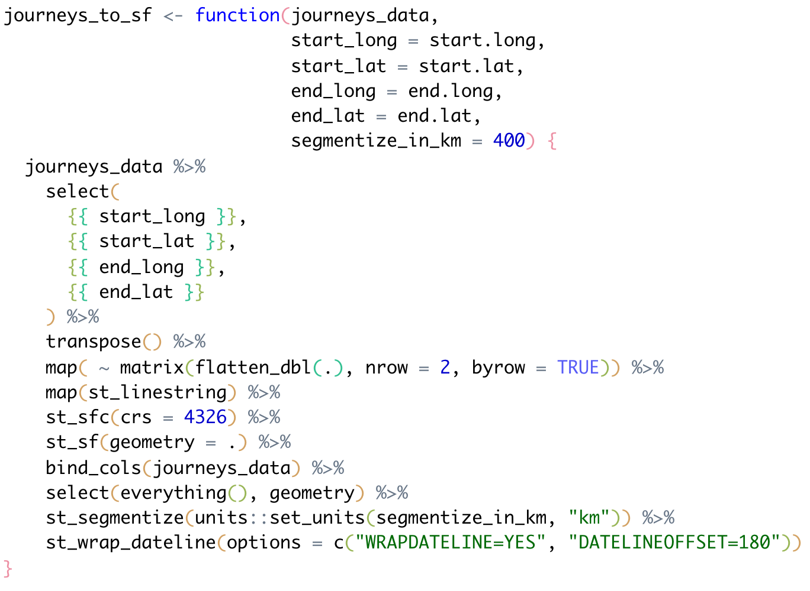

```{r child = "setup.Rmd"}
```

```{r, include=FALSE, eval = TRUE}
options(htmltools.preserve.raw = FALSE)
library(tidyverse)
library(readxl)
library(janitor)
library(sf)
library(mapview)
```


# Agenda

--

1. Housekeeping

--

1. Four Tips

--

1. Group work

--

1. Functions

--

1. Next Week

---

# Housekeeping

Time Zones changes **again** next week.

---

class: inverse, center, middle

# Four Tips

---

(I'll write these as I go through the feedback)

---

class: inverse, center, middle

# Functions

---

## Bible URL Generator

```{r, include=FALSE}
bible_url_generator <- function(book_name = NA,
                          begin_chapter = NA,
                          begin_v = NA,
                          end_chapter = NA,
                          end_v = NA,
                          link_text = NA) {
  paste0(
    "<a href=",
    "https://www.biblegateway.com/passage/?search=",
    gsub(" ", "+", book_name),
    "+",
    begin_chapter,
    "%3A",
    begin_v,
    "+-+",
    end_chapter,
    "%3A",
    end_v,
    "&version=NRSV",
    ">",
    link_text,
    '<span class="glyphicon glyphicon-new-window" aria-hidden="true"></span>',
    "</a>"
  )
}
```



---

## Bible URL Generator

<a href='https://idn.it.ox.ac.uk/article/paul-and-patristics'></a>

---

## Branding Charts

```{r}
ilabour_branding <- function(x) {
  hc_credits(
    hc = x,
    text = 'Source: Online Labour Index',
    enabled = TRUE,
    href = 'http://ilabour.oii.ox.ac.uk/online-labour-index/',
    position = list(align = "right")
  )
}
```

---

## Branding Charts

<center><a href='https://ilabour.oii.ox.ac.uk/online-labour-index/'></a></center>

---

### Drawing lines between points on a map (I)

```{r, include=FALSE}
journeys_to_sf <- function(journeys_data,
                           start_long = start.long,
                           start_lat = start.lat,
                           end_long = end.long,
                           end_lat = end.lat,
                           segmentize_in_km = 400) {
  journeys_data %>%
    select(
      {{ start_long }},
      {{ start_lat }},
      {{ end_long }},
      {{ end_lat }}
    ) %>%
    transpose() %>%
    map( ~ matrix(flatten_dbl(.), nrow = 2, byrow = TRUE)) %>%
    map(st_linestring) %>%
    st_sfc(crs = 4326) %>%
    st_sf(geometry = .) %>%
    bind_cols(journeys_data) %>%
    select(everything(), geometry) %>%
    st_segmentize(units::set_units(segmentize_in_km, "km")) %>%
    st_wrap_dateline(options = c("WRAPDATELINE=YES", "DATELINEOFFSET=180"))
}
```

.pull-left[



]

.pull-right[
This function has the following goal:

- Convert start and end points into great circles.

The function has the following features:

- The function can be given *naked column names* similar to tidyverse function<sup>1</sup>.

- The function segments the great circle into straight lines, with a default curvature of 400km.
]

.footnote[
[1] Learn how to [program with {dplyr} <br>using **tidy evaluation**](https://dplyr.tidyverse.org/articles/programming.html)
]

---

```{r, echo=TRUE, eval=TRUE}
air_routes_seat_kms <- 
  read_excel("data/air-routes.xlsx",
             sheet = "seat-kilometers") %>%
  clean_names()

air_routes_seat_kms
```

---

```{r, eval=TRUE}
air_routes_seat_kms %>%
  journeys_to_sf(airport_1_long,
                 airport_1_lat,
                 airport_2_long,
                 airport_2_lat) %>% 
  mapview()
```

---

# Next Week

--

Next week's lessons provide advice about exporting tidied raw data

--

Project assignment: (if appropriate) redesign your R project as follows:

- move raw data into the `data-raw` folder

- move your tidying script into the `data-raw` folder

- export a tidied version of your data into the `data` folder


