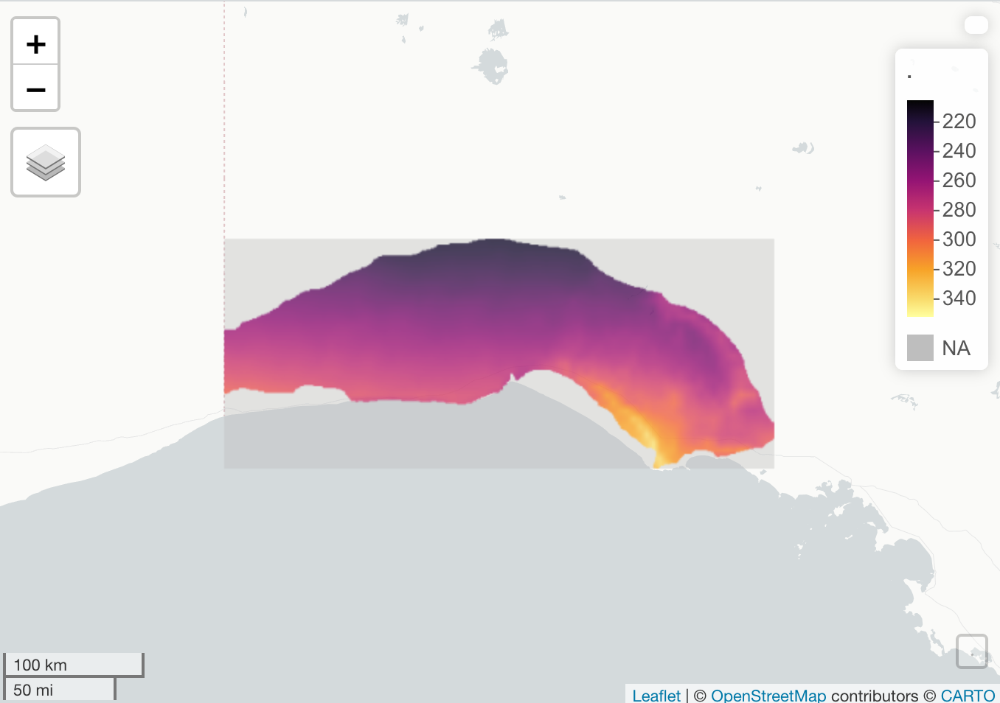
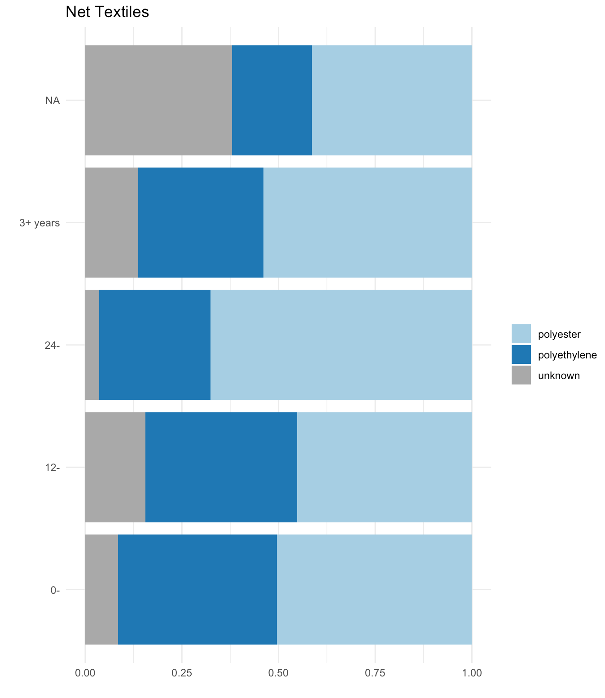
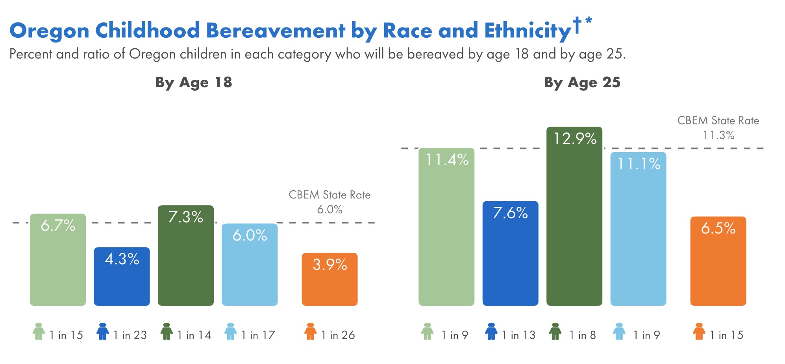

```{r child = "setup.Rmd"}
```

```{r, include=FALSE, eval = TRUE}
options(htmltools.preserve.raw = FALSE)
library(tidyverse)
library(readxl)
library(janitor)
```


# Agenda

--

1. Housekeeping

--

1. A Few of My Favorite Functions

--

1. Examples of High-Quality Data Viz

--

1. Next Week

---

class: inverse, center, middle

# Housekeeping

---

## Remaining Schedule

Week 10 (starting after live session November 18): Advanced data viz, part 1

Thursday, November 25 is US Thanksgiving so we will not have a live session

Week 11 (starting after live session November 25): Advanced data viz, part 2

Week 12 (starting after live session December 2): Advanced RMarkdown

Last live session: December 16

---

## 1:1 with Charlie

Book another 1:1 with Charlie - [rfor.us/charliechat](https://rfor.us/charliechat)

---

## Deadline for Feedback

Charlie will provide feedback for submissions made before 1st January 2021

--

You'll have access to materials FOREVER

---

class: inverse, center, middle

# Example function submissions

---

## Sarah's data cleaning function

.pull-left[
```{r}
clean_bat_data <- function(raw_data, data_year) {
  raw_data %>% 
    mutate(year = data_year) %>%
    rename(night = `date_12`) %>% #
    filter(auto_id != "Noise") %>% 
    group_by(folder) %>% 
    mutate(site = str_split(folder, pattern = "\\\\")[[1]][1]) %>%  
    ungroup()  
}
```

]

.pull-right[
Sarah's function saves writing the same code for multiple data files.


(Charlie - You've called this project rin3_R_bat_courseproject)
]

---

## Juan's bar charts

.pull-left[
```{r}
ability_bar_graphs <- 
  function(ability_type, title2) {
  ggplot(data = ability_scale,
         mapping = aes_string(x = ability_type)) +
    geom_bar() +
    coord_flip() +
    labs(title = title2,
         x = "Ability Rating",
         y = "")
}
```

]


.pull-right[
Juan's function creates a bar chart allowing the user to select the category column and the title of the chart.

(Charlie - you called this project rin3_delete_r-project-juan)

]

---

## Ione's cropping function

.pull-left[

]

.pull-right[
Ione's function allows her to crop weather datasets to a specific region of interest.

(Charlie - You've called this project rin3_delete_W8)
]

---

## Hannah's group_by chart

.pull-left[

]

.pull-right[
This function depends on group_by() being passed a column name.

(Charlie - You've called this project rin3_delete_Textile)
]

???


---

class: inverse, center, middle

# Examples of High-Quality Data Viz

---

## Charlie's diverging bars

.pull-left[
I'm going to work on building and improving this diverging bar chart for a continuous variable:

```{r, echo=FALSE, eval=TRUE}
library(WDI)

country_codes <- c("AF", "AL", "DZ", "AS", "AD", "AO", "AI", "AQ", "AG", "AR", 
                   "AM", "AW", "AU", "AT", "AZ", "BS", "BH", "BD", "BB", "BY", "BE", 
                   "BZ", "BJ", "BM", "BT", "BO", "BQ", "BA", "BW", "BV", "BR", "IO", 
                   "BN", "BG", "BF", "BI", "CV", "KH", "CM", "CA", "KY", "CF", "TD", 
                   "CL", "CN", "CX", "CC", "CO", "KM", "CD", "CG", "CK", "CR", "HR", 
                   "CU", "CW", "CY", "CZ", "CI", "DK", "DJ", "DM", "DO", "EC", "EG", 
                   "SV", "GQ", "ER", "EE", "SZ", "ET", "FK", "FO", "FJ", "FI", "FR", 
                   "GF", "PF", "TF", "GA", "GM", "GE", "DE", "GH", "GI", "GR", "GL", 
                   "GD", "GP", "GU", "GT", "GG", "GN", "GW", "GY", "HT", "HM", "VA", 
                   "HN", "HK", "HU", "IS", "IN", "ID", "IR", "IQ", "IE", "IM", "IL", 
                   "IT", "JM", "JP", "JE", "JO", "KZ", "KE", "KI", "KP", "KR", "KW", 
                   "KG", "LA", "LV", "LB", "LS", "LR", "LY", "LI", "LT", "LU", "MO", 
                   "MG", "MW", "MY", "MV", "ML", "MT", "MH", "MQ", "MR", "MU", "YT", 
                   "MX", "FM", "MD", "MC", "MN", "ME", "MS", "MA", "MZ", "MM", NA, 
                   "NR", "NP", "NL", "NC", "NZ", "NI", "NE", "NG", "NU", "NF", "MP", 
                   "NO", "OM", "PK", "PW", "PS", "PA", "PG", "PY", "PE", "PH", "PN", 
                   "PL", "PT", "PR", "QA", "MK", "RO", "RU", "RW", "RE", "BL", "SH", 
                   "KN", "LC", "MF", "PM", "VC", "WS", "SM", "ST", "SA", "SN", "RS", 
                   "SC", "SL", "SG", "SX", "SK", "SI", "SB", "SO", "ZA", "GS", "SS", 
                   "ES", "LK", "SD", "SR", "SJ", "SE", "CH", "SY", "TW", "TJ", "TZ", 
                   "TH", "TL", "TG", "TK", "TO", "TT", "TN", "TR", "TM", "TC", "TV", 
                   "UG", "UA", "AE", "GB", "UM", "US", "UY", "UZ", "VU", "VE", "VN", 
                   "VG", "VI", "WF", "EH", "YE", "ZM", "ZW", "AX")

gdp_annual_growth <- WDI(country = country_codes,
    indicator = c(gdp_growth = "NY.GDP.MKTP.KD.ZG"))


gdp_recent_growth <- gdp_annual_growth %>% 
  filter(year == max(year)) %>% 
  as_tibble() %>% 
  drop_na()

gdp_recent_extremes <- slice_max(gdp_recent_growth, gdp_growth, n = 5) %>% 
  bind_rows(slice_min(gdp_recent_growth, gdp_growth, n = 5))

gdp_recent_extremes %>% 
  ggplot(aes(x = gdp_growth,
             y = country)) +
  geom_col()
```


]

.pull-right[
David has written an [awesome blogpost](https://rfortherestofus.com/2021/10/diverging-bar-chart/) on diverging bar charts for a categorical variable.


]

???

Charlie's example code is in misc/charlies-data-viz-example.R

---

## CBEM Bar Charts




---

# Next Week

--

Course assignment: Advanced Data Viz, Part 1

--

Project assignment: Take one of your previous visualizations and improve it using the principles you learn about this week (reordering, using color to highlight findings, etc)

--

No live session but there will be office hours

--

Please submit anything you're working on at any point

--

Book another 1:1 with Charlie - [rfor.us/charliechat](https://rfor.us/charliechat)

