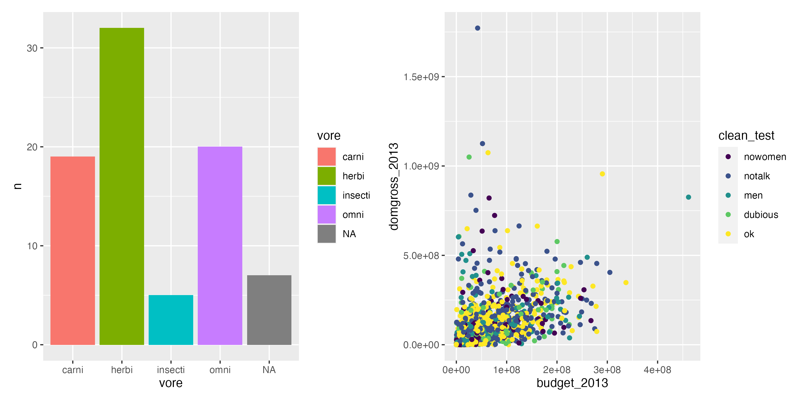
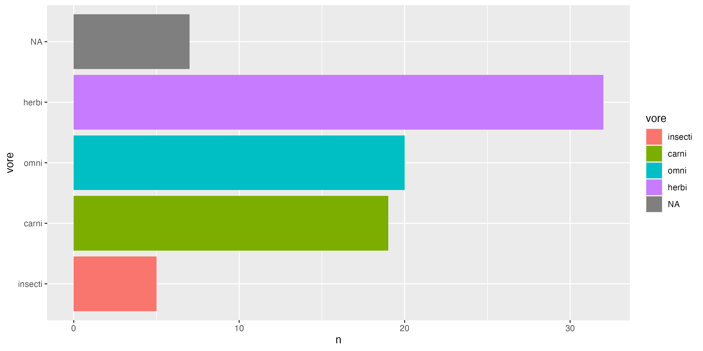
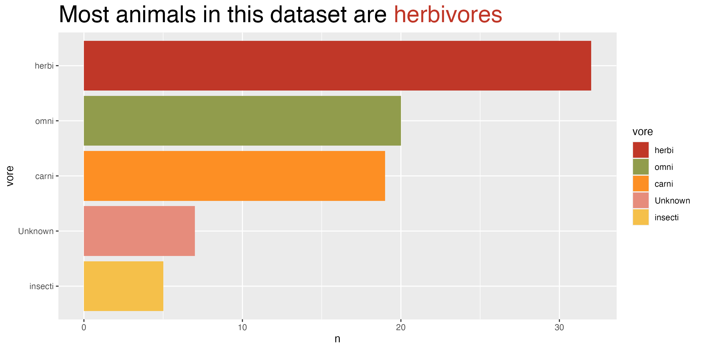

```{r child = "setup.Rmd"}
```

```{r, include=FALSE, eval = TRUE}
options(htmltools.preserve.raw = FALSE)
library(tidyverse)
library(fivethirtyeight)
library(readxl)
library(janitor)
library(patchwork)
library(here)
library(gapminder)
library(ggtext)
```


# Agenda

--

1. Assignments amnesty

--

1. Housekeeping

--

1. This week's assignment

--

1. The final assignment

--

1. Group work

--

1. Next week

---

class: inverse, center, middle

# Assignments amnesty

---

### Jump back in where it makes sense for you

- Week 4: build a graph of your data, it doesn't matter how beautiful it is.

```{r include=FALSE}
gg_week_4_col <- msleep %>% 
  count(vore) %>% 
  ggplot(aes(x = vore,
             y = n,
             fill = vore)) +
  geom_col()

gg_week_4_scatter <- bechdel %>% 
  ggplot(aes(x = budget_2013,
             y = domgross_2013,
             color = clean_test)) +
  geom_point()

gg_week_4_export <- gg_week_4_col + gg_week_4_scatter


ggsave(here("slides", "images", "gg_week_4_export.png"),
       gg_week_4_export,
       width = 10,
       height = 5)

```



---

### Jump back in where it makes sense for you

- Week 7: is your data long or wide? Use pivot_longer() or pivot_wider() to show us.

```{r, eval=FALSE}
billboard
```

```{r, echo=FALSE, eval=TRUE, paged.print=FALSE}
billboard
```


---

### Jump back in where it makes sense for you

- Week 8: user-defined functions, they're much more exciting than they sound. Build a function that does something useful for you.

.pull-left[
```{r}
gapminder %>% 
  filter(year == 2007,
         continent == "Asia") %>% 
  ggplot(aes(x = lifeExp,
             y = gdpPercap)) +
  geom_point()
```
]

.pull-right[
```{r}
gapminder_plot <- 
  function(filter_continent){
  
  gapminder %>% 
  filter(year == 2007,
         continent == filter_continent) %>% 
  ggplot(aes(x = lifeExp,
             y = gdpPercap)) +
  geom_point()
  
}

gg_gapminder_plot("Oceania")
```

]


---

### Jump back in where it makes sense for you

- Week 10: Advanced dataviz part 1: Use factors or declutter your charts.

```{r}
msleep %>% 
  count(vore) %>% 
  mutate(vore = fct_reorder(vore, n))
```


```{r, include=FALSE}
gg_week_10_col <- msleep %>% 
  count(vore) %>% 
  mutate(vore = fct_reorder(vore, n)) %>% 
  ggplot(aes(y = vore,
             x = n,
             fill = vore)) +
  geom_col()

ggsave(here("slides", "images", "gg_week_10_col.png"),
       gg_week_10_col,
       width = 10,
       height = 5)
```



---

class: inverse, center, middle

# Housekeeping


---

## 1:1 with Charlie

Book another 1:1 with Charlie - [rfor.us/charliechat](https://rfor.us/charliechat)


---

#### Remaining Schedule

--

- Week 12

  - Office hours
  
  - Live session
  
--
  
- Week 13

  - Office hours
  
  - Last Live session (16th December!)

--

- Assignments

  - Please submit before 1st January 2022

---

class: inverse, center, middle

## This week's assignment

---

### Week 11's assignment

In the reminder email last week I set out the assignment as follows:

> Try new geoms, tables or coloured titles to add story to your charts.

```{r}
library(ggtext)
gg_plot_char + 
  labs(title = "Most animals in this dataset are <span style='color:#c03728'>herbivores</span>") +
  theme(plot.title = element_markdown())
```


```{r, eval=TRUE, echo=FALSE}
vore_colors <- set_names(ggpomological:::pomological_palette[1:5], c("herbi", "omni", "carni", "insecti", "Unknown")) %>% 
  as.list()

vore_frq <- msleep %>% 
  count(vore) %>% 
  mutate(vore = fct_explicit_na(vore, "Unknown")) %>% 
  mutate(vore = fct_reorder(vore, n))

vore_colors <- vore_colors[rev(levels(vore_frq$vore))]

gg_vore_freq <- vore_frq %>% 
  ggplot(aes(y = vore,
             x = n,
             fill = vore)) +
  geom_col() +
  scale_fill_manual(values = vore_colors,
                    na.value = ggpomological:::pomological_palette[5]) +
  labs(title = str_glue("Most animals in this dataset are <span style='color:{vore_colors$herbi}'>herbivores</span>")) +
  theme(plot.title = element_markdown(size = 24))

ggsave(here("slides", "images", "gg_vore_freq.png"),
       gg_vore_freq,
       width = 10,
       height = 5)
```



---

class: inverse, center, middle

## Final assignment


---

### Final assignment

We'd love to understand how R in 3 Months is going to help you with your work/datasets.

--

We'd like you to record a 5 minute video showing something you can now do with your real data/project.

--

> [Loom.com](https://www.loom.com/pricing) has a free tier that will allow you to record and share 5 minute videos.

There's a form to fill on [the final project assignment submission page](https://rfortherestofus.com/courses/r-in-3-months-fall-2021/lessons/r-in-3-months-fall-2021-final-project-assignment/).

---

class: inverse, center, middle

# Group work

---

## Data viz exercise

Copy code from https://gist.githubusercontent.com/dgkeyes/8e6ae05003dac8fc6a928a9d1230f955/raw/d23ea91d8a7f2d5f1c10ce410a39ca057daba268/data-viz-exercise.R

--

Decipher the visualization.


---

# Next Week

--

Course assignment: Advanced RMarkdown

--

Project assignment: Switch your report to some other format (slides, dashboard, etc)

